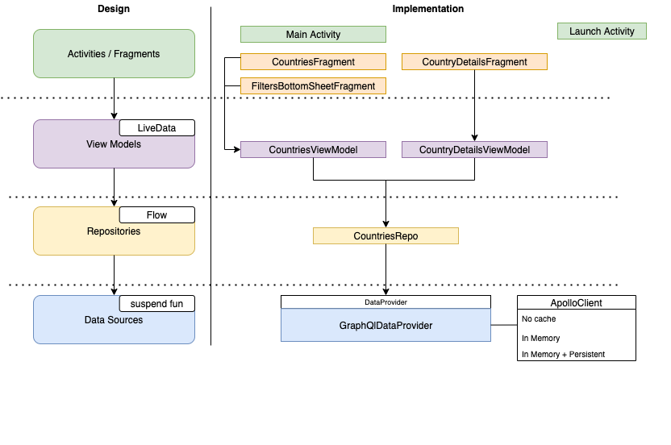

# countries-app

The app allows the to:

- See a list of all countries in the world
- Filter the list based on one continent and/or one language
- Show a detailed view of a country of the list

Based on injected cache module, the app can also work offline (with already fetched data)

## Architecture

Architecture Overview



## Components and libraries

UI and Navigation : Androidx Navigation, ViewModel and LiveData (with relative kotlin extensions), Androidx Emoji lib
DependencyInjection: Dagger Hilt
GraphQl Client : ApolloClient (Android) + lib for caching
Logger: Timber
Leak detector: LeakCanary

## Tests

the app project contains 3 classes of Instrumented test:

- DataInstrumentedTest: test the dataProvider component (request/response and to model mapping) without mocks (integration test)
- CountriesViewModelTest: test CountriesViewModel using the real CountriesRepo but with mocked DataProvider
- CountryDetailsViewModelTest: test CountryDetailsViewModel using the real CountriesRepo but with mocked DataProvider

## Configuration (BuildConfigField)

- CONFIGURE_CACHE: To switch off the DataProvider caching, set the buildConfigField CONFIGURE_CACHE to false.
- CACHE_DB_NAME: Name of the persistent cache database
- COUNTRY_SERVER_URL: Url of countries graphql server

## Offline support

To enable offline support (with cached data), edit **GraphqlModule** and change qualifier of injected
**NormalizedCacheFactory from `@MemoryOnlyCache` to `@MemoryAndPersistentCache`

(Default is @MemoryOnlyCache to help development)

```kotlin
@Module
@InstallIn(SingletonComponent::class)
class GraphqlModule {

    @Provides
    fun provideApolloClient(@MemoryAndPersistentCache cache: NormalizedCacheFactory): ApolloClient {
        //....
    }
}   
```
